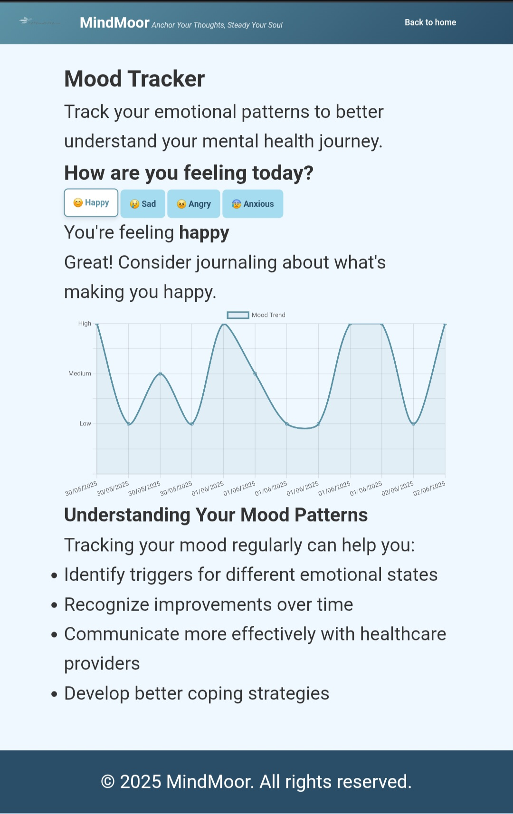

# MindMoor - Mental Wellness Platform


[](https://app.netlify.com/sites/mindmoor/deploys) 

A holistic web platform for mental wellness featuring mood tracking, therapeutic exercises, and AI-powered support.
## ✨ Key Features

### 🧠 Core Functionality
- **Mood Tracker** with visual analytics (Chart.js)
- **Guided Breathing Exercises** (4-7-8, Box Breathing, Relaxing Breath)
- **5-4-3-2-1 Grounding Technique** for anxiety relief
- **Digital Journal** with local storage persistence

### 🤖 AI Support
- **Moira Chatbot** - 24/7 mental health companion
- **Context-aware responses** using Hugging Face API
- **Typing indicators** for natural conversation flow

### 🎨 Design Highlights
- **Calming color palette** designed for mental wellness
- **Fully responsive** across all deviceshttps://mindmoor.netlify.app/moira-chatbot/moira
- **Accessible UI** with proper contrast and ARIA labels
- **Smooth animations** for therapeutic experience

## 🚀 Getting Started

### Prerequisites
- Modern web browser (Chrome, Firefox, Edge)
- Internet connection (for AI features)

### Installation
```bash
git clone https://github.com/ramokhua/mindmoor.git
cd mindmoor
```

### Running Locally
1. Open `index.html` in your browser
2. Or use Live Server extension in VS Code

## 🌐 Live Deployment
[](https://mindmoor.netlify.app/)

## 🛠️ Tech Stack

### Frontend
| Technology | Use Case |
|------------|----------|
| HTML5 | Semantic structure |
| CSS3 | Styling and animations |
| JavaScript | Core functionality |
| Chart.js | Mood visualization |

### Backend
| Technology | Use Case |
|------------|----------|
| LocalStorage | Data persistence |
| Hugging Face API | AI conversation |

## 📸 Feature Showcase

| Feature | Preview | Description |
|---------|---------|-------------|
| Mood Tracker |  | Visualize emotional patterns over time |
| Breathing Exercises |  | Animated guides for stress relief |
| Moira Chatbot |  | AI mental health companion |

## 📖 User Guide

1. **Mood Tracking**
   - Click emoji buttons to log your mood
   - View trends in your analytics dashboard

2. **Therapeutic Tools**
   - Follow guided breathing animations
   - Complete the 5-4-3-2-1 grounding exercise
   - Journal your thoughts with automatic saving

3. **Moira Chatbot**
   - Type your feelings in natural language
   - Receive supportive, context-aware responses
   - Access crisis resources when needed

## 📈 Roadmap

- [ ] User accounts with Firebase
- [ ] Mood correlation analysis
- [ ] Community support features

## 🤝 How to Contribute

1. Fork the repository
2. Create your feature branch (`git checkout -b feature/AmazingFeature`)
3. Commit your changes (`git commit -m 'Add some AmazingFeature'`)
4. Push to the branch (`git push origin feature/AmazingFeature`)
5. Open a Pull Request


## 🙏 Acknowledgments

- **Human Computer Interaction (CSI392)** - Project inspiration
- **Chart.js** - Beautiful data visualization
- **Hugging Face** - AI conversation models
- **Netlify** - Free hosting and deployment

---

<div align="center">
  <p>Made with ❤️ and JavaScript</p>
  <p>Anchor Your Thoughts, Steady Your Soul</p>
</div>
